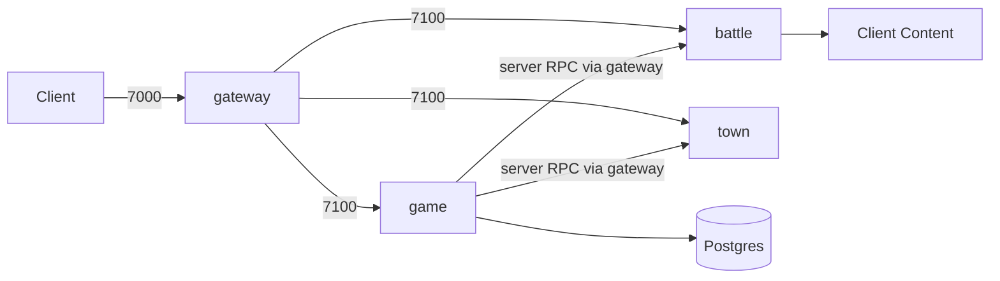

# AxmolFighter-Server

本地联调用的服务端集合。客户端只连 **gateway**；game / battle / town 作为后端主动连上 gateway，再按协议号分流。

## 服务一览

| 服务 | 技术 | service_id | 默认端口 / 连接 | 职责 |
|------|------|-------------|-----------------|------|
| gateway | Rust | — | 客户端 `0.0.0.0:7000`；内部 `0.0.0.0:7100` | 接入、路由、会话绑定 |
| game | Rust | `0` | 连 gateway `127.0.0.1:7100`；Postgres | 账号、角色、业务逻辑 |
| battle | C++ | `1` | 连 gateway `127.0.0.1:7100` | 战斗房间、tick、同步 |
| town | Rust | `2` | 连 gateway `127.0.0.1:7100` | 城镇场景 |

`service_id` 定义见 [`game/backend-framework/src/service_id.rs`](game/backend-framework/src/service_id.rs)，路由见 [`game/gateway/gateway.toml`](game/gateway/gateway.toml)。

## 关系



要点：

- **客户端**只连 gateway 的 `client_listen`（`:7000`）。
- **后端**（game / battle / town）主动连 gateway 的 `internal_listen`（`:7100`）并注册。
- gateway 按 **msg_id** 把客户端包路由到对应服务：
  - `1–19999` → game（`require_binding = false`）
  - `20000–29999` → battle（`require_binding = true`）
  - `30000–39999` → town（`require_binding = true`）
- game 通过 gateway 向 battle / town 发**服务间 RPC**（例如建战斗、进出城镇）。内部协议大致：`60000–60999` game↔battle，`61000–61999` game↔town。
- battle 需要可读的 Content（`content_root`，默认指向 `../AxmolFighter-Client/Content`），用于加载 `config.bin` 与战斗资源。

## 目录与配置

```
AxmolFighter-Server/
├── game/                 # Rust Cargo workspace
│   ├── gateway/          # 网关 + gateway.toml
│   ├── game/             # 游戏服 + game.toml（含数据库）
│   ├── town/             # 城镇服（当前 gateway 地址硬编码）
│   ├── backend-framework/
│   ├── base/
│   └── protocol/
├── battle/               # C++ CMake 工程（battle_server）
│   └── config/battle.toml
├── run-*.ps1             # 单进程启动
├── start-stack.ps1       # 一键启 gateway+game+town（前台窗口看日志）
├── start-stack-bg.ps1    # 同上，后台启动
└── stop-stack.ps1        # 一键停栈
```

## 本地启动

建议顺序：**先起 gateway**，再起 game / town / battle。game 需要 `game.toml` 里配置的 Postgres 可用。

单独前台运行：

```powershell
cd D:\work\AxmolFighter\AxmolFighter-Server
.\run-gateway.ps1
.\run-game.ps1
.\run-town.ps1
.\run-battle.ps1
# 可选：.\run-battle.ps1 config\battle_2.toml
```

一键拉起 / 关闭网关 + 游戏 + 城镇（不含 battle）：

```powershell
.\start-stack.ps1       # 默认：各开一个前台窗口，可实时看日志
.\start-stack-bg.ps1    # 后台拉起（无独立日志窗）
.\stop-stack.ps1        # 两种启动方式共用
```

战斗服用单独窗口：

```powershell
.\run-battle.ps1
```
